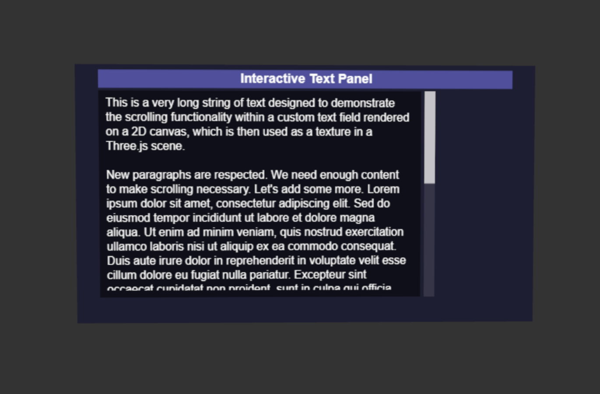

# XR-UI-Tools

[XR-UI-Tools](https://XR-UI-Tools.netlify.app/)

# Three.js Interactive Canvas UI

A standalone HTML example demonstrating an interactive 2D UI rendered onto a 3D plane in a Three.js scene. This UI features a scrollable text area with a custom scrollbar.

## Features

*   **2D UI on 3D Plane:** Renders a 2D interface (drawn on an HTML5 Canvas) as a texture onto a `THREE.PlaneGeometry`.
*   **Scrollable Text Area:** Displays large amounts of text within a defined area, with custom text wrapping.
*   **Custom Scrollbar:**
    *   Visually represents the scroll position and content length.
    *   Interactive thumb for dragging to scroll.
    *   Hover effects on the scrollbar thumb.
*   **Interaction Management:**
    *   Handles mouse hover for UI elements.
    *   Manages conflicts between custom UI interactions (scrollbar drag) and `OrbitControls` (camera rotation) by temporarily disabling camera controls during UI interaction.
*   **Responsive (Basic):** The UI content (text wrapping) re-adapts on window resize.

## How to Use

1.  **Download:** Get the `index.html` (or whatever you name the HTML file) from this repository.
2.  **Open:** Open the HTML file directly in a modern web browser that supports ES6 Modules (e.g., Chrome, Firefox, Edge, Safari).

    No build step or local server is strictly required for this single-file example as it uses ES6 module imports directly from a CDN.

## Code Structure (within `index.html`)

*   **HTML:** Basic structure with a `<script type="importmap">` for Three.js module loading and a `<script type="module">` for the application code.
*   **CSS:** Minimal inline CSS for basic page layout.
*   **JavaScript (ES6 Module):**
    *   **Initialization (`initializeScene`):** Sets up the Three.js scene, camera, renderer, `OrbitControls`, and the UI plane.
    *   **UI Configuration:** Constants and objects defining the dimensions, appearance, and content of UI elements (text field, scrollbar).
    *   **Canvas Drawing (`drawUIToCanvas`):** Handles all 2D drawing operations for the UI elements onto the offscreen canvas.
    *   **Text Handling (`prepareTextContent`, `wrapText`):** Manages text wrapping and calculation of text dimensions for scrolling.
    *   **Interaction Logic (Event Handlers):**
        *   `onCanvasMouseMove`: Handles hover states and scrollbar dragging.
        *   `onCanvasMouseDown`: Initiates scrollbar dragging and disables camera controls.
        *   `onDocumentMouseUp`: Ends scrollbar dragging and re-enables camera controls.
        *   `onWindowResize`: Updates UI and camera on window resize.
    *   **Animation Loop (`animate`):** Redraws the UI canvas when needed, updates controls, and renders the Three.js scene.

## Potential Enhancements

*   More UI elements (buttons, input fields, sliders).
*   Keyboard navigation for accessibility.
*   Advanced styling options.
*   Integration into a larger Three.js/XR project.

---

This project serves as a foundational example of creating custom, interactive 2D UIs within a 3D WebGL environment using Three.js and the HTML5 Canvas API.
